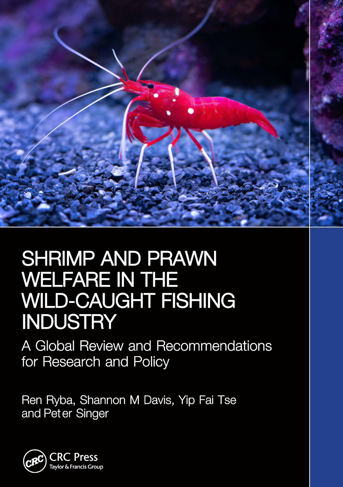

Available for purchase from [Routledge](https://www.routledge.com/Shrimp-and-Prawn-Welfare-in-the-Wild-Caught-Fishing-Industry-A-Global-Review-and-Recommendations-for-Research-and-Policy/Ryba-Davis-Tse-Singer/p/book/9781032901459), publication date 2025-09-26

> At 37 trillion individuals per year, wild-caught shrimp and prawns appear to be the single most numerous group of animals directly killed for human food consumption on the planet. Recent scientific developments suggest that at least some species of shrimp are sentient beings, and, should that be the case, there is a need for policies that could improve shrimp welfare.
>
> This book delves into the ethical implications of the probability that shrimp and prawns are capable of feeling pain and the welfare policies that could be adopted. It looks at global shrimp fisheries and their different animal welfare concerns, from the largest industrial trawlers in developed and developing countries to small-scale fisheries in developing countries. The authors provide a new dataset of the estimated numbers of individual shrimp caught by country and species, using this to describe the shrimp fishing industry in the world's top 30 countries by estimated catch.
>
> Examining recent developments in government and industry policy, the book suggests ways that policymakers could improve wild-caught shrimp welfare, from installing electrical stunning equipment in large-scale trawl fisheries to improving supply chain practices in small-scale fisheries. It provides a roadmap for future research and policy to address this urgent, emerging challenge.
>
> This book's data, visualisations, and roadmap will empower researchers, NGOs, and policymakers to focus their efforts on the most impactful and evidence-based solutions for improving aquatic animal welfare.  

{: width='500' }  
